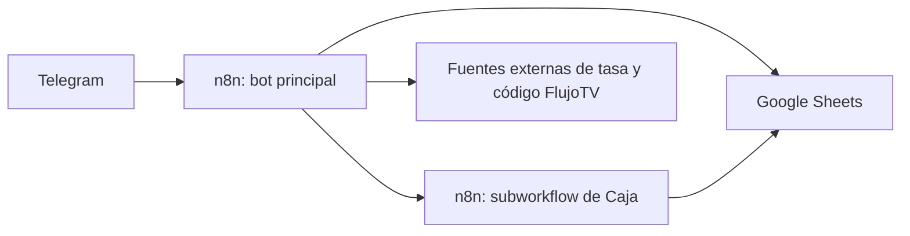
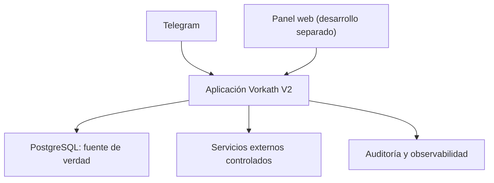

# 00 — Sistema actual

## 1. Alcance de este documento

Este documento describe Vorkath V1 tal como se observa en producción. Su objetivo es preservar conocimiento de negocio y facilitar la migración. No autoriza cambios y no convierte decisiones técnicas heredadas en requisitos de V2.

## 2. Arquitectura productiva observada

Componentes:

- **Telegram:** interfaz utilizada por Gabriel y Edward.
- **n8n, workflow principal:** clasifica intenciones, consulta disponibilidad, registra ventas, busca clientes, renueva, forma mensajes y dispara tareas programadas.
- **n8n, subworkflow de Caja:** registra ingresos, solicita método de pago, calcula montos, conserva operaciones pendientes y actualiza resúmenes.
- **Google Sheets:** fuente de verdad productiva actual.
- **Fuentes externas:** se usan para tasa diaria y la información/código de instalación de FlujoTV.

## 3. Hojas y responsabilidades observadas

| Hoja | Uso observado | Limitación para V2 |
|---|---|---|
| `NETFLIX` | Inventario, asignaciones, credenciales, cliente, teléfono, fechas, monto y operador. | Mezcla cuenta, perfil, cliente, venta y estado en filas. |
| `FLUJO TV` | Inventario y asignaciones de perfiles/cuentas completas. | Mezcla conceptos de cuenta y suscripción. |
| `LOGS_CHAT` | Estado conversacional por `chat_id`, última lista y datos temporales. | Usa columnas genéricas y borra/reutiliza estado; fuerte acoplamiento al workflow. |
| `Tasas_Bot` | Tasa del día y precios. | Mezcla configuración comercial con historial de tasa. |
| `CAJA` | Historial y acumuladores semanales. | Combina libro histórico con celdas resumen mutables. |
| `LOGS_CAJA` | Operación de caja pendiente. | Estado temporal y financiero quedan acoplados. |
| `INVENTARIO` | Avisos asociados a cuentas/proveedores. | El concepto exacto depende de filas y texto. |

Los nombres son evidencia del sistema actual, no nombres obligatorios de tablas futuras.

## 4. Capacidades existentes

El bot actual expone o contiene rutas para:

- ayuda general;
- precios y tasa mediante lenguaje natural y `/tasa`;
- disponibilidad Netflix y FlujoTV;
- venta de perfil o cuenta completa;
- registro de datos del cliente;
- búsqueda por teléfono;
- respuesta de “no encontrado” cuando la búsqueda normal no tiene coincidencias;
- envío de datos de ingreso;
- selección cuando un teléfono tiene varios servicios;
- renovaciones individuales y múltiples (capacidad histórica V1; la variante múltiple no se adopta en V2);
- renovaciones por meses o días;
- cancelación de procesos;
- mensajes/enlaces de WhatsApp;
- consulta de ventas diaria, semanal y mensual;
- notificación de vencidos y próximos a vencer;
- notificación de cuentas próximas a pagar al proveedor;
- obtención de códigos de instalación de FlujoTV;
- operaciones de caja con botones, montos sugeridos y monto manual.

El sistema mantiene sesiones conversacionales en `LOGS_CHAT`. Los estados observados incluyen espera de teléfono, selección, tiempo de renovación, datos de venta y operación de caja. La continuidad existe, pero está representada como campos reutilizados y `row_number` de Sheets.

## 5. Comportamientos observados que sí coinciden con decisiones de V2

- El teléfono es el dato operacional más frecuente para buscar clientes.
- Si hay varios servicios, el usuario puede seleccionar cuál atender.
- Los métodos actuales son Pago Móvil, Zelle y Binance.
- El monto en bolívares se calcula con una tasa; USD/USDT conservan el equivalente nominal.
- Telegram prepara información para WhatsApp.
- Existen reportes y avisos automáticos no críticos.
- El operador se infiere hoy del identificador de Telegram.

## 6. Comportamientos heredados no aprobados automáticamente para V2

Los siguientes comportamientos fueron hallados en el código actual, pero no deben convertirse en regla normativa sin decisión expresa:

- La nota del workflow dice tasa automática a las 09:00, mientras un cron observado corre a las 08:30.
- Una renovación parte siempre de la fecha de vencimiento existente, aunque ya haya vencido.
- FlujoTV convierte 6 meses solicitados en 7 agregados y 12 en 14.
- Para cobros por días, el flujo financiero observado transforma días a fracciones de 30 días.
- El PIN Netflix se genera con los últimos cuatro dígitos del teléfono.
- Algunos flujos permiten Netflix cuenta completa, pero no existe precio/costo aprobado en esta especificación.
- Existe una ruta denominada “crédito FlujoTV” con un valor fijo observado; su significado contable y su continuidad en V2 no están aprobados.
- En ciertas fallas de tasa el flujo actual puede usar la última tasa con aviso. V2 no puede presentarla como tasa actual sin decisión explícita del operador.

El siguiente comportamiento queda expresamente clasificado como **COMPORTAMIENTO V1 QUE NO SE ADOPTA EN V2**:

- seleccionar varios servicios o `Todas` para consolidar sus renovaciones;
- crear una renovación múltiple, un solo cobro, un solo movimiento de Caja o un rollback conjunto para varios servicios.

En V2, cada renovación corresponde a una sola suscripción/servicio y tiene borrador, confirmación, pago, movimiento, auditoría y transacción propios. Tras terminar una, la UX puede ofrecer iniciar la siguiente.

Todos estos puntos son `PENDIENTE DE DECISIÓN` donde afecten V2.

## 7. Riesgos del sistema actual

1. **Acoplamiento a filas:** `row_number` funciona como identidad temporal y puede cambiar por edición, ordenamiento o inserciones.
2. **Desnormalización:** una fila reúne credenciales, cuenta, perfil, cliente, pago y fechas.
3. **Actualizaciones parciales:** una operación atraviesa varios nodos y hojas; una falla intermedia puede dejar estados divergentes.
4. **Borrado de contexto:** el estado conversacional se limpia sobrescribiendo columnas, con poca historia estructurada.
5. **Credenciales recuperables sin contrato de cifrado:** Sheets contiene datos que V2 deberá cifrar.
6. **Lógica duplicada:** Netflix y FlujoTV repiten rutas similares con variantes difíciles de mantener.
7. **Finanzas por acumuladores:** los totales semanales pueden depender de celdas actualizadas, no de un libro inmutable.
8. **Reglas dentro de código:** precios, promociones, identidad de operadores y mensajes aparecen incrustados.
9. **IA como control de flujo:** extractores devuelven texto/JSON, pero la consistencia final depende de muchos nodos posteriores.
10. **Seguridad operacional:** la revelación de credenciales y el cambio de contraseñas necesitan auditoría explícita.

## 8. Frontera durante la construcción

Durante todo el desarrollo previo al corte:

- Sheets continúa como única fuente de verdad productiva.
- n8n y el bot actuales continúan operando sin modificaciones.
- PostgreSQL usa exclusivamente datos ficticios.
- No existe escritura doble.
- La nueva aplicación no debe consumir credenciales productivas.
- Los workflows exportados se usan como evidencia, nunca como plantilla de despliegue.

## 9. Arquitectura objetivo a alto nivel

La lógica de dominio debe vivir en una capa compartida por Telegram y el panel web. Ninguna interfaz debe escribir directamente en tablas ni duplicar reglas financieras o de asignación. La construcción del panel queda fuera del alcance actual de OpenCode + Gentle-AI; el objetivo actual es Telegram/backend con Netflix y FlujoTV.

## 10. Evidencia mínima que debe conservarse para migración

- Exportaciones de todas las hojas relevantes con fecha y hash.
- Definición de columnas y significados reales.
- Conteos por servicio, modalidad, estado e inventario.
- Identidad de cuentas, perfiles, clientes y teléfonos.
- Fechas de inicio/vencimiento y asignaciones activas.
- Caja histórica, operaciones pendientes y tasa usada.
- Proveedores, ciclos e incidencias disponibles.
- Mensajes/plantillas que deban preservarse.

La evidencia no debe contener secretos en reportes o logs. Los archivos originales deben manejarse como material sensible.
