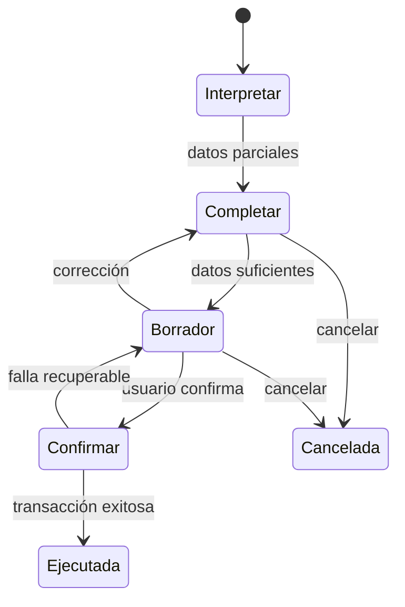

# 02 — Principios de UX

## 1. Regla central

> **Preguntar solamente lo que falta.**

Vorkath debe extraer datos del mensaje, recuperar contexto confiable y solicitar únicamente lo necesario para completar la operación actual.

Ejemplo:

> `renueva 04141234567 Netflix 2 meses Pago Móvil Edward`

Si el teléfono resuelve un único cliente y una única suscripción Netflix, Vorkath no vuelve a preguntar teléfono, cliente, servicio, duración, método ni receptor. Debe completar el borrador y presentar un resumen antes de ejecutar.

## 2. Interacción híbrida

El usuario puede:

- comenzar escribiendo y continuar con botones;
- comenzar con botones y completar escribiendo;
- corregir en lenguaje natural;
- volver al paso anterior;
- cancelar sin dejar una operación aplicada a medias.

El patrón contractual es `menú principal pequeño + botones contextuales + lenguaje natural`. Los botones deben representar opciones válidas para el contexto actual, y escribir la misma intención debe modificar el mismo borrador. No debe existir un árbol gigante de menús ni mostrar acciones imposibles.

## 3. Jerarquía de fuentes para completar un borrador

Vorkath completa cada campo en este orden:

1. dato explícito del mensaje actual;
2. corrección explícita posterior del usuario;
3. selección mediante botón contextual;
4. dato inequívoco recuperado del dominio, como una única suscripción para ese teléfono;
5. valor configurable aprobado, solamente si la regla permite aplicarlo;
6. pregunta al usuario.

Nunca debe completar con una inferencia ambigua. Una coincidencia múltiple exige selección.

## 4. Ciclo universal de operación

1. **Interpretar:** detectar intención y entidades sin mutar el negocio.
2. **Completar:** preguntar solo lo faltante.
3. **Borrador:** mostrar una vista legible de lo que ocurrirá.
4. **Confirmar:** exigir confirmación en acciones críticas.
5. **Ejecutar:** aplicar atómicamente con clave de idempotencia.
6. **Trazar:** guardar actor, entrada, resultado y entidades afectadas.

## 5. Borradores

Un borrador:

- pertenece a una sesión, organización y operador;
- tiene tipo de operación y versión;
- conserva campos extraídos, seleccionados y corregidos;
- no reserva inventario indefinidamente;
- no modifica asignaciones, credenciales ni finanzas;
- permanece pendiente indefinidamente hasta `CONFIRMAR` o `CANCELAR` explícitamente;
- debe detectar si la información base cambió antes de confirmar.

La permanencia del borrador no implica una reserva permanente de inventario. La disponibilidad se revalida al confirmar.

Si el inventario o una suscripción cambió entre resumen y confirmación, Vorkath debe invalidar la parte afectada, explicar el cambio y ofrecer alternativas válidas.

## 6. Confirmación proporcional al riesgo

### 6.1 Lecturas no sensibles

Disponibilidad agregada, estado general, tasa y resúmenes no críticos no requieren confirmación.

### 6.2 Lecturas sensibles

Revelar credenciales no modifica datos, pero es sensible. Debe:

- mostrarse solo a un usuario autorizado;
- evitar contraseñas en listas de selección;
- registrar evento de revelación;
- limitar el contenido al servicio elegido.

### 6.3 Escrituras operacionales

Ventas y renovaciones requieren resumen y confirmación porque alteran asignaciones, vencimientos y Caja.

### 6.4 Acciones críticas

Requieren confirmación inequívoca:

- venta y renovación;
- cambio de contraseña;
- cambio de correo/usuario o perfil;
- liberación de perfil/cuenta;
- reemplazo por incidencia;
- cuenta caída y acción de garantía de proveedor;
- pago, conversión Bs→USDT, costo o salida de Bolsa;
- corrección posterior a confirmación;
- cierre semanal.

Buscar, consultar precio/tasa/inventario, ver vencidos u obtener el código FlujoTV son lecturas y no requieren confirmación crítica.

## 7. Correcciones

### 7.1 Antes de confirmar

Frases como “No, son dos meses”, “Fue Edward”, “Era FlujoTV” o “Es el otro perfil” deben modificar el borrador vigente. Vorkath vuelve a mostrar el resumen actualizado si la corrección afecta un dato relevante.

### 7.2 Después de confirmar

Una operación confirmada no se sobrescribe silenciosamente. Se crea:

- una operación de corrección o ajuste;
- referencia a la operación original;
- motivo;
- actor y fecha;
- efecto compensatorio sobre asignaciones y/o dinero;
- evento de auditoría.

El lenguaje debe decir “ajuste registrado” y no insinuar que el historial anterior desapareció.

## 8. Selección y ambigüedad

- Un teléfono con un solo cliente abre su ficha.
- Un teléfono con varios clientes muestra botones identificables y sin credenciales.
- Un teléfono sin clientes asociados responde únicamente que el cliente/número no fue encontrado y ofrece `Escribir otro número` o `Volver`.
- La búsqueda normal por teléfono no ofrece crear cliente; esa posibilidad pertenece exclusivamente al flujo explícito de Venta nueva.
- Un cliente con varios servicios muestra cada servicio, modalidad, estado y vencimiento.
- Un correo/usuario de cuenta muestra primero la cuenta y sus perfiles/clientes asociados.
- “Todas” o “renovar todas” nunca crea una renovación consolidada. Si la intención abarca varios servicios, Vorkath procesa uno y, al terminarlo, puede ofrecer iniciar el siguiente como un borrador independiente.
- Una opción inexistente no se adivina.

Las listas deben usar identificadores legibles y estables durante la sesión, no números de fila de la base de datos.

## 9. Resúmenes antes de confirmar

El resumen debe responder, según la operación:

- ¿Qué se hará?
- ¿A qué cliente/teléfono?
- ¿Qué servicio, cuenta y perfil?
- ¿Desde qué fecha hasta cuál fecha?
- ¿Cuánto se cobró, en qué moneda y método?
- ¿Quién recibió el dinero?
- ¿Quién opera?
- ¿Qué inventario o credencial se afectará?
- ¿Existe una advertencia, emergencia o incidencia?

Los secretos solo se incluyen si son necesarios. Una contraseña nueva puede mostrarse parcialmente en el resumen y revelarse completa después de confirmar, con auditoría.

## 10. Respuesta posterior

Tras ejecutar, Vorkath debe entregar:

- estado claro: `Registrado`, `No registrado` o `Requiere atención`;
- identificador corto de operación;
- principales cambios aplicados;
- acciones contextuales siguientes;
- botón/enlace directo `wa.me` si aplica, con teléfono y mensaje completo prellenado, sin afirmar que se envió.

No debe usar “éxito” antes de confirmar la transacción en la base de datos.

## 11. Errores y recuperación

- Explicar el problema con lenguaje operacional, no con excepciones técnicas.
- Conservar el borrador ante errores recuperables.
- No repetir una operación si el resultado de un intento es incierto; consultar primero su idempotencia.
- Ofrecer `Reintentar`, `Corregir`, `Volver` o `Cancelar` según el estado.
- Si falla una dependencia externa, no debe perderse el contexto.
- Los errores de seguridad deben revelar la mínima información posible.

## 12. Sesiones

Una sesión debe conservar:

- intención activa;
- borrador y versión;
- lista contextual mostrada;
- entidades seleccionadas;
- paso pendiente;
- fecha de última actividad;
- canal, chat y operador.

Un comando nuevo incompatible debe pedir si se desea abandonar el borrador activo. Una consulta de solo lectura puede ejecutarse sin destruirlo si no crea ambigüedad.

La operación/borrador no expira por inactividad. Puede recuperarse aunque el callback o la sesión técnica de transporte haya caducado. En ese caso, Vorkath carga el estado actual y emite botones contextuales nuevos; nunca cancela ni elimina la operación por la expiración del botón.

## 13. Seguridad visible y discreta

- No mostrar secretos en menús, notificaciones matutinas ni mensajes de error.
- No incluir contraseñas en logs técnicos.
- No repetir credenciales innecesariamente.
- Permitir credenciales vigentes en el mensaje WhatsApp prellenado cuando la atención lo requiera, generándolo solo para un usuario autorizado y durante el tiempo mínimo.
- No persistir ni registrar la URL `wa.me` completa; tampoco enviar su texto sensible a auditoría o analytics.
- Diferenciar “abrir WhatsApp” de “mensaje enviado”.
- Marcar el perfil de emergencia de forma visible y pedir confirmación especial.
- Cuando un dato esté desactualizado o sea manual, indicarlo.

## 14. Frontera con el panel web

El panel web se construye por separado y queda fuera del alcance de UI actual. El dominio/backend debe permitir que ese panel conserve:

- los mismos borradores y confirmaciones;
- las mismas reglas de permisos;
- la misma trazabilidad;
- los mismos estados del dominio.

No puede crear atajos que permitan modificar directamente una fila y evitar reglas de negocio.

## 15. Pruebas UX obligatorias

- Mensaje completo: no pregunta datos repetidos.
- Mensaje parcial: pregunta exactamente el primer dato necesario.
- Teléfono inexistente en búsqueda normal: solo informa no encontrado y permite otro número o volver.
- El mismo teléfono dentro de Venta nueva: permite recopilar datos y crear el cliente como parte de la venta.
- Corrección antes de confirmar: modifica borrador, no crea operación.
- Corrección después: crea ajuste enlazado.
- Teléfono compartido: obliga a seleccionar cliente.
- Múltiples servicios: no revela credenciales en la lista.
- Renovación de dos servicios: crea y confirma dos operaciones secuenciales, nunca un pago o rollback conjunto.
- Venta sin inventario: solo informa el faltante y no crea cliente pendiente, Seguimiento, espera, reserva ni asignación.
- Doble pulsación: una sola operación.
- Inventario cambiado: invalida resumen y recalcula.
- Botón antiguo: no ejecuta una acción fuera de contexto.
- Botón expirado: no cancela el borrador y permite regenerar acciones contextuales.
- Link WhatsApp: abre directamente el chat correcto con el mensaje completo prellenado y confirma preparación, no envío.
