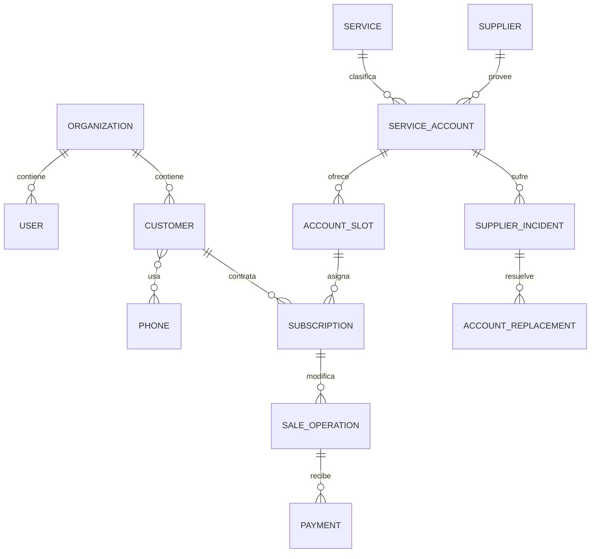

# 05 — Modelo de dominio

## 1. Principio

El modelo representa hechos del negocio, no pestañas de Sheets ni pasos de n8n. Telegram y el panel web desarrollado por separado deben invocar las mismas operaciones de dominio.

## 2. Vista de relaciones

La relación cliente–teléfono se implementa mediante una entidad de enlace. La relación mostrada como muchos-a-muchos es conceptual.

## 3. Núcleo de identidad

### Organization

Frontera de pertenencia y aislamiento. V2 tiene una sola organización inicial, pero las entidades sensibles guardan su organización.

Invariantes:

- todo usuario, cliente, cuenta, operación y evento pertenece a una organización;
- una relación no puede cruzar organizaciones.

### User

Actor interno. Contiene estado, rol y nombre; no debe depender de Telegram para existir.

### ExternalIdentity

Vincula un usuario con un canal, por ejemplo Telegram. Permite que el panel web desarrollado por separado use el mismo actor y dominio sin duplicarlo.

### Role/Permission

En alcance inicial basta `OWNER`. El modelo debe permitir permisos futuros, sin construir un editor complejo.

## 4. Clientes y contacto

### Customer

Persona o entidad atendida. Contiene nombre, ubicación y estado general. No contiene un único teléfono ni credenciales.

La ubicación (`CUSTOMER_LOCATION`, opcional) conserva el texto indicado más ciudad/región/país solo cuando el texto los afirma —nunca inferidos, nunca dirección exacta ni GPS. Es independiente de `PAIS_CUENTA` en ambas direcciones (BR-CUS-006/BR-CUS-010).

### Phone

Número canónico y valor original. Puede vincularse a varios clientes.

### CustomerPhone

Relación con etiquetas como principal/secundario, vigencia y notas. La unicidad es por organización, cliente y teléfono.

### FollowUp

Seguimiento abierto o cerrado, vinculado a cliente y opcionalmente a suscripción/incidencia. No expira automáticamente. La liberación manual de una asignación vencida crea un seguimiento abierto como efecto obligatorio de la misma operación.

La falta de inventario durante Venta nueva no crea `FollowUp` ni lista de espera. Un seguimiento puede cerrarse por acción manual o por un flujo confirmado posterior de renovación/recontratación que contemple esa transición.

## 5. Catálogo e inventario

### Service

Catálogo técnico cuyo alcance funcional actual contiene únicamente Netflix y FlujoTV. La estructura evita rigidez futura, pero no define comportamiento para otros servicios.

### ServicePlan

Oferta comercial configurable por servicio y modalidad, por ejemplo `NETFLIX_PROFILE`, `FLUJOTV_PROFILE` o `FLUJOTV_FULL`. Conserva precio vigente y permite versionado.

### ServiceAccount

Cuenta adquirida/gestionada. Campos de dominio: servicio, identificador de acceso, país de cuenta, estado, proveedor y ciclo.

### CredentialVersion

Versión identificable de contraseña u otro secreto. Solo la versión vigente debe conservar el valor cifrado y recuperable. Las versiones anteriores pueden conservar metadatos de estado y relación de sucesión sin retener el secreto recuperable.

### CredentialChange

Hecho de rotación que vincula cuenta, versión anterior, versión nueva, actor, fecha, motivo y clientes afectados. Permite demostrar el cambio sin almacenar la contraseña antigua. Una retención temporal del valor anterior solo existiría bajo una política explícita y limitada.

### AccountSlot

Unidad asignable. Propiedades:

- tipo: comercial, emergencia o exclusiva/completa;
- etiqueta/número de perfil;
- capacidad/exclusividad;
- estado operacional;
- prioridad de asignación.

Una cuenta completa puede modelarse como un slot exclusivo que representa el acceso total, siempre que no conviva con asignaciones activas de perfiles incompatibles.

### InventoryAcquisition

Registra alta/compra física de cuentas o créditos del proveedor para trazabilidad. No determina por sí sola el costo semanal reconocido.

### InventoryThreshold

Umbral configurable por servicio, modalidad y categoría de slot.

## 6. Relación comercial

### Subscription / Assignment

Une cliente, plan y slot durante un periodo. Representa tanto la suscripción comercial como la ocupación de inventario.

Estados recomendados del hecho de asignación:

- `ACTIVE`: ocupa el slot;
- `RELEASED`: liberado manualmente;
- `REPLACED`: sustituido mediante operación;
- `CANCELLED`: anulado antes de activación si corresponde.

`VIGENTE`, `POR_VENCER` y `VENCIDO` son estados temporales derivados de `expires_on`; no deben reemplazar el estado de ocupación. Al liberar una asignación vencida, pasa a `RELEASED`, deja de ocupar el slot, deja de pertenecer a la proyección de vencidos activos y genera Seguimiento automáticamente.

### SaleOperation

Cabecera inmutable de venta nueva, renovación individual, corrección, liberación o reemplazo. Contiene operador, estado, idempotencia, fecha, canal y referencia a operación original cuando es ajuste. Una operación de renovación solo puede modificar una suscripción/servicio.

### OperationItem

Detalle por suscripción/plan. Conserva tiempo solicitado, tiempo otorgado, fechas y precio aplicado. Para `RENEWAL` existe exactamente un item; otra suscripción requiere otra operación, pago, movimiento de Caja, auditoría y transacción.

### DraftOperation

Estado preconfirmación. Guarda campos, procedencia, versión y contexto. No es un hecho financiero ni reserva final. Permanece pendiente indefinidamente hasta confirmación o cancelación explícita; la inactividad o expiración de un callback no lo elimina.

## 7. Dinero

### Payment

Dinero recibido por una operación. Registra monto, moneda, método, receptor y equivalencia/tasa histórica.

### CashHolder

Persona/custodio que recibió dinero: inicialmente Gabriel o Edward. No equivale necesariamente a `User`, aunque puede vincularse.

### CashMovement

Entrada, salida, transferencia o ajuste del libro. Es inmutable y enlaza el evento que lo originó.

### BusinessWallet

Bolsa acumulada del negocio, por ejemplo Zelle y Binance/USDT. El saldo se deriva de movimientos, no se sobrescribe.

### OperationalCostPolicy

Configuración versionada del costo variable por unidad vendida.

### RecurringCostPolicy

Concepto, monto, moneda, frecuencia y vigencia de costos recurrentes.

### ExpensePayment

Pago real de un costo desde una Bolsa. No debe confundirse con reconocimiento contable del costo por venta.

### ExchangeRate

Tasa para una fecha operacional, fuente, condición manual/automática y actor si fue manual.

### WeeklyClosure

Snapshot confirmado de una semana y sus cálculos. Se deriva de movimientos; una corrección posterior es un ajuste enlazado. El fin del domingo nunca lo crea automáticamente: requiere revisión y confirmación explícita posterior.

## 8. Proveedores e incidencias

### Supplier

Proveedor de cuentas o inventario.

### SupplierCycle

Periodo/obligación de la cuenta con el proveedor. Admite intervalos de pausa y reanudación.

### SupplierIncident

Incidencia sobre una cuenta. Contiene tipo, fecha de caída, estado, decisión y proveedor.

### IncidentAffectedAssignment

Relaciona la incidencia con cada suscripción afectada y su decisión: reemplazo interno, espera o reemplazo recibido.

### AccountReplacement

Vincula cuenta anterior/nueva, incidencia, fechas, días pausados y responsable. No borra ninguna de las cuentas.

## 9. Comunicación

### MessageTemplate

Plantilla configurable y versionada por tipo, servicio, idioma y estado. Los tipos iniciales cubren acceso, vencimiento, renovación, cambio de contraseña, cambio de correo/usuario, cambio de perfil y reemplazo. No contiene credenciales reales.

### PreparedMessage

Referencia de preparación por destinatario, plantilla/versión y estado `PREPARED`. Genera bajo autorización un `wa.me` directo con teléfono y cuerpo completo específico del cliente; la URL completa nunca se persiste. Preferentemente conserva variables no secretas y renderiza al usar. Si una política posterior exige almacenar temporalmente contenido con credenciales, requiere cifrado y retención explícita y limitada.

### InstallationInfo

Información vigente de instalación/código FlujoTV, con fuente y fecha de actualización.

## 10. Conversación y auditoría

### ConversationSession

Sesión por canal/chat/usuario. Mantiene la referencia a la operación activa y la última actividad. Si la sesión técnica o un callback caduca, el borrador de negocio continúa y puede rehidratarse con botones nuevos.

### ConversationContext

Lista contextual y selecciones vigentes. Evita interpretar “la 2” fuera de la lista correcta. El contexto de botones puede caducar sin cancelar la operación.

### AuditEvent

Evento append-only para accesos sensibles y operaciones críticas. Guarda referencias y metadatos protegidos; nunca secretos en claro.

## 11. Invariantes transversales

1. No existen relaciones entre organizaciones distintas.
2. Un slot exclusivo tiene como máximo una asignación `ACTIVE`.
3. Un `VENCIDO` puede continuar `ACTIVE`.
4. Un pago confirmado genera movimientos contables correlacionados exactamente una vez.
5. Una operación confirmada no se edita; se ajusta.
6. Una credencial vigente y recuperable por cuenta/ámbito; las anteriores conservan trazabilidad de versión sin requerir el secreto recuperable.
7. Una incidencia cerrada conserva cuentas y asignaciones anteriores.
8. Un cierre semanal se deriva de movimientos y conserva la política de costos usada.
9. Una opción conversacional solo es válida dentro de su sesión y versión de contexto.
10. El saldo de Bolsa se deriva del libro de movimientos.
11. Una operación pendiente no expira automáticamente; solo termina por confirmación o cancelación explícita.
12. Liberar una asignación vencida libera inventario y crea Seguimiento en la misma operación.
13. Un callback expirado no modifica el estado de la operación.
14. Cada renovación confirmada afecta una sola suscripción/servicio; no existe agregado de renovación múltiple.
15. La falta de inventario no crea cliente pendiente, seguimiento, reserva, espera ni asignación.
16. Una preparación WhatsApp puede caducar y regenerarse sin cambiar la operación de negocio; su URL completa no es un hecho persistente.
17. Un cierre semanal nunca se confirma por calendario o job.

## 12. Agregados y fronteras transaccionales

| Agregado | Raíz | Operaciones atómicas principales |
|---|---|---|
| Inventario de cuenta | `ServiceAccount` | alta, cambio de credencial, estado, slots. |
| Suscripción | `Subscription` | venta, renovación, liberación con verificación de credencial y seguimiento, reemplazo. |
| Operación comercial | `SaleOperation` | cabecera, item individual de renovación cuando corresponda, pago y efectos correlacionados. |
| Incidencia | `SupplierIncident` | abrir, esperar, reemplazar, cerrar. |
| Caja/Bolsa | `CashMovement` / `WeeklyClosure` | registrar, transferir, pagar costo, cerrar. |
| Conversación | `ConversationSession` | actualizar borrador/contexto, confirmar/cancelar. |

Las transacciones que afectan varios agregados deben coordinarse en el backend con una única unidad de trabajo o un patrón que preserve atomicidad e idempotencia. No se permite que Telegram ejecute actualizaciones independientes de tablas.

## 13. Pendientes del modelo

- Política exacta de coexistencia entre slot “cuenta completa Netflix” y perfiles.
- Naturaleza de “crédito FlujoTV”.
- Retención/cifrado de `PreparedMessage`.
- Pagos divididos: el modelo puede soportar varios pagos por operación, pero la UX inicial queda pendiente.
- Estados adicionales de cliente no están aprobados; no importar etiquetas de Sheets como enum sin análisis.
